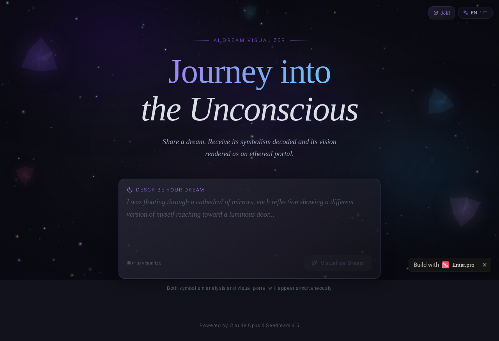
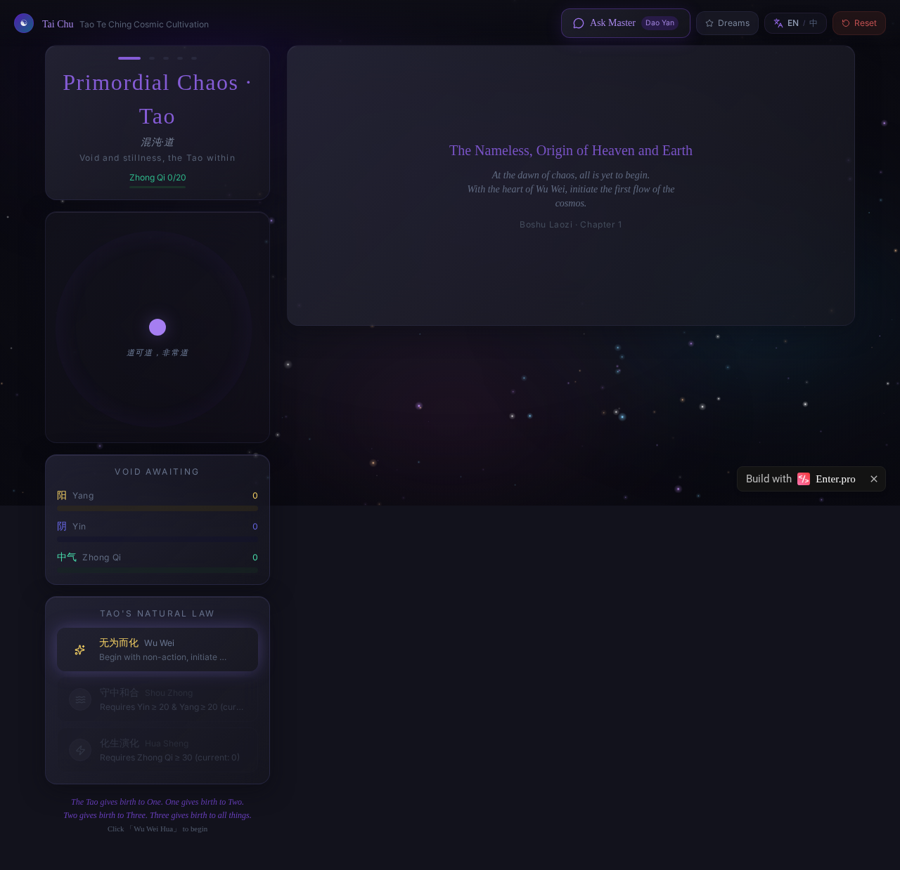

# Cosmic Dream AI

[](https://enter.pro)
[](https://b0d845535fb9446a852dae6d6c93f0ea-latest.preview.enter.pro)

> 两个 AI 驱动的灵性体验，合而为一。  
> *Two AI-powered spiritual experiences, unified in one platform.*

---

## What We Built

**Cosmic Dream AI** 是一个融合东方智慧与现代 AI 技术的灵性探索平台，包含两个核心体验：

### 1. AI Dream Visualizer（AI 梦境可视化）

一个沉浸式「梦境解析门户」，用户输入梦境描述后，系统同步：
- 用 **Claude Opus 4.7** 以荣格原型学与象征主义解析梦境深层含义（400-500字流式诗意叙述）
- 用 **Seedream 4.5** 将梦境化为超现实视觉门户图像

深空午夜美学：交互式星空粒子背景、浮动水晶、玻璃拟态卡片。

### 2. 太初·道 — 道德经宇宙养成游戏

基于**帛书老子（马王堆手稿）**「道生一，一生二，二生三，三生万物」宇宙论的养成游戏：

- **5 个宇宙阶段**：混沌·道 → 太极·一 → 两仪·阴阳 → 三才·中气 → 万物·化生
- **可交互宇宙观**：按阶段点击/拖拽阴阳球体，实时影响资源积累
- **AI 化生叙事**：每次触发化生，Claude 生成对应阶段的诗意中文叙述 + Seedream 生成宇宙图像
- **天地裂开仪式**：阶段晋升时全屏「天地裂开」动画，阶段专属配色与帛书引文
- **道衍智能体集成**：直连道衍 AI 对话 API，流式回答，完整多轮对话历史
- **中英双语切换**：界面与 AI 叙事均跟随语言切换

---

## Screenshots

### AI Dream Visualizer


### 太初·道 — Tao Te Ching Cosmic Cultivation


---

## Live URL

**访问地址：** https://b0d845535fb9446a852dae6d6c93f0ea-latest.preview.enter.pro

| 页面 | 路径 |
|------|------|
| AI 梦境可视化 | `/` |
| 宇宙养成游戏 | `/tao` |

---

## Who It's For

| 受众 | 痛点 | 价值 |
|------|------|------|
| **冥想 / 灵性探索者** | 难以理解梦境与内心象征 | AI 给出深度符号学解读 |
| **道家哲学爱好者** | 帛书老子晦涩难懂 | 通过互动游戏体验宇宙论 |
| **艺术 / 创意从业者** | 缺乏视觉灵感工具 | 一键生成超现实梦境图像 |
| **正念 App 用户** | 现有 App 缺乏深度 AI 内容 | 沉浸式叙事 + 互动体验 |
| **中文用户 / 海外华人** | 东方哲学内容稀缺 | 中英双语、根植中华宇宙观 |

---

## Commercialization

### 直接变现路径

**1. 订阅 SaaS（Freemium）**
- 免费层：每日 3 次梦境解析 / 游戏进度不保存
- Pro 月订阅（¥39/月）：无限解析、HD 图像下载、游戏存档云同步
- 年付优惠（¥299/年）

**2. B2B 白标授权**
- 面向冥想 App（如潮汐、keep）、正念平台输出 SDK
- 道德经教育机构嵌入互动课程
- 定制企业冥想健康福利包

**3. 内容电商**
- 梦境图像 NFT 或高清印刷品一键购买
- AI 生成个性化「宇宙命盘」报告付费下载（PDF）

**4. 道衍 AI 联运**
- 与道衍智能体深度绑定，作为道衍的游戏化前端入口
- 合作分成：用户通过游戏进入道衍对话产生 API 调用

### 增长策略
- 梦境图像天然适合小红书、Instagram 病毒传播
- 游戏晋升仪式截图可被用户分享（社交钩子）
- 帛书老子 IP 在国学复兴浪潮中具有稀缺性

---

## Tech Stack

| 层级 | 技术 |
|------|------|
| Frontend | React 18 + TypeScript + Vite |
| UI | shadcn/ui + Tailwind CSS (深空设计系统) |
| AI 文本 | Claude Opus 4.7 (SSE 流式传输) |
| AI 图像 | Seedream 4.5 |
| AI 对话 | 道衍 Agent REST API |
| 后端 | Supabase Edge Functions (Deno) |
| i18n | react-i18next (中英双语) |
| 状态管理 | useReducer + localStorage |

---

## Local Development

```bash
# 克隆仓库
git clone https://github.com/daoAgents/enter-CosmicDreamAI.git
cd enter-CosmicDreamAI

# 安装依赖
pnpm install

# 启动开发服务器
pnpm dev
```

> 注意：AI 功能需要配置 `AI_API_TOKEN` 环境变量（通过 Enter Cloud 后端函数）。

---

## Project Links

- **Live App:** https://b0d845535fb9446a852dae6d6c93f0ea-latest.preview.enter.pro
- **Enter.pro Editor:** https://enter.pro/project/b0d845535fb9446a852dae6d6c93f0ea
- **GitHub:** https://github.com/daoAgents/enter-CosmicDreamAI

---

*道可道，非常道。名可名，非常名。— 帛书老子·第一章*

[](https://enter.pro)
